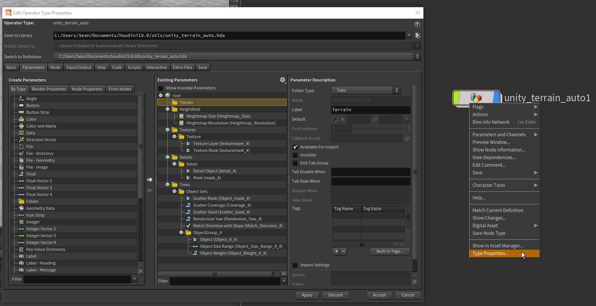

# Unity-Terrain-HDAs

HDA's for creating Terrain in Unity with Houdini Engine\
HDAs created and tested with Houdini 19.0.498\
Assets in images from [Terrain Sample Asset Pack](https://assetstore.unity.com/packages/3d/environments/landscapes/terrain-sample-asset-pack-145808 "Terrain Sample Asset Pack") & [Unity Terrain - HDRP Demo Scene](https://assetstore.unity.com/packages/3d/environments/unity-terrain-hdrp-demo-scene-213198 "Unity Terrain - HDRP Demo Scene")

## unity_terrain_basic_example.hda
A HDA provided to as a learning guide to show you how to assign attributes for material, details and trees.

## unity_terrain_auto.hda
This HDA is designed to automate the process of assigning materials details and trees. You can define the layers in houdini and then make all the assignments in Unity.

# How to use the unity_terrain_auto.hda

**Important: There is an issue with Terrain details and HDRP were instancing must be enabled for each detail**

- Copy the files into your otls directory "C:\Users\YourUser\Documents\houdini19.0\otls"

- Place the node in houdini

- Allow editing of contents

- Save As your new node so your changes won't modify the original

- Remove nodes and replace with your own terrain setup. When assigning material layers the sum of the layers must equal 1\
  

You can add properties for your terrain in the Type Properties of the node and put them in the empty terrain folder provided

- Save the Node Type and then copy it into you Unity Project

- After creating a houdini engine session drag the HDA into the scene

- Assign Textures\
Reminder: When assigning material layers the sum of the layers must equal 

- Assign Trees\
You can have multiple scatter groups which can contain multiple trees. You can change the weight parameter to change the distribution of the tree type amongst the group

- Assign Details\
How to enable instancing for HDRP shown below\
Once the details are assigned you can modify the detail density by editing the details on the terrain (the same window where you enable instancing)

## IMPORTANT: Details with HDRP
The instancing property for details needs to be enabled for use with HDRP

