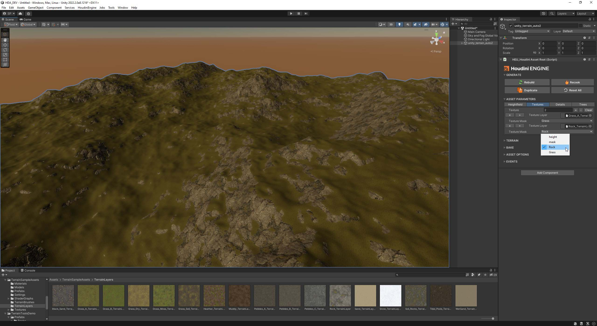

# Unity-Terrain-HDAs

HDA's for creating Terrain in Unity with Houdini Engine\
HDAs created and tested with Houdini 19.0.498

## unity_terrain_basic_example.hda
A HDA provided to as a learning guide to show you how to assign attributes for material, details and trees.

## unity_terrain_auto.hda
This HDA is designed to automate the process of assigning materials details and trees. You can define the layers in houdini and then make all the assignments in Unity.

## How to use the unity_terrain_auto.hda - in progress
Important: If you are already familiar with Houdini engine and unity this process is fairly simple. However there is an issue with HDRP that is resolved here.

Steps:

Copy the files into your otls directory "C:\Users\YourUser\Documents\houdini19.0\otls"

Place the node in houdini

Allow editing of contents

Save As

Remove nodes and replace with your own

  

Save

Use HDA in Unity project

Assign Textures

Assign Trees

Assign Details

## IMPORTANT: Details with HDRP
The instancing property for details needs to be enabled for use with HDRP

